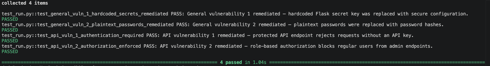

# Python Application Security Hardening

## Authentication, Secrets Management, and Access Control

## Overview

This project focused on hardening an existing Python Flask application by remediating several common application security weaknesses. The original application contained hardcoded configuration secrets, plaintext password records, missing API authentication, and authorization logic that granted access without verifying a user’s role.

The remediation introduced environment-based secrets management, PBKDF2-SHA256 password hashing through Werkzeug, Bearer-token authentication, and role-based access control. I also completed an additional hardening pass that added parameterized SQL queries, safer error handling, input validation, protection for destructive endpoints, filtering of sensitive data, and disabled Flask debug mode.

Automated tests were executed after the changes to confirm that the required controls still functioned correctly and that the additional hardening did not introduce regressions.

---

# Project Objectives

The primary goals of this project were to:

- Move application configuration secrets out of the source code.
- Replace plaintext password records with password hashes.
- Verify passwords without directly comparing plaintext credentials.
- Require authentication for protected API endpoints.
- Enforce role-based authorization using the principle of least privilege.
- Return the correct HTTP response when authentication or authorization fails.
- Validate each required security control through automated testing.
- Complete an additional hardening pass to address obvious remaining risks.

---

# Initial Assessment

A review of the application source code identified several security weaknesses that could expose credentials, allow unauthorized access, or reveal sensitive information.

The primary findings included:

- Application secrets were hardcoded directly in the source code.
- User passwords were stored in plaintext records.
- The API authentication function did not validate requests.
- The authorization function always returned `True`.
- Administrative functionality could be accessed without verifying the user’s role.
- SQL queries were built through string concatenation.
- Some API responses exposed more information than necessary.
- Internal exception details could be returned to clients.
- Destructive and data-creation endpoints lacked consistent authentication.
- Flask debug mode was enabled.

These findings established the remediation and hardening plan implemented throughout the project.

---

# Security Improvements

The following sections show the original code, the secured implementation, the threat addressed, and the specific attack path or failure that was closed.

---

## Secure Secrets Management

### Purpose

Application configuration secrets were moved out of the source code and loaded from environment variables. Secure random values are generated when environment variables are not available.

### Before

```python
app.secret_key = 'supersecretkeyforflasksessions'
API_KEY = "sk_live_abc123xyz789secretkey"
DB_USER = "admin"
DB_PASSWORD = "password123"
```

### After

```python
app.secret_key = os.environ.get(
    'FLASK_SECRET_KEY',
    secrets.token_hex(32)
)

API_KEY = os.environ.get(
    'API_KEY',
    secrets.token_urlsafe(32)
)

DB_USER = os.environ.get(
    'DB_USER',
    'rental_app_user'
)

DB_PASSWORD = os.environ.get(
    'DB_PASSWORD',
    secrets.token_urlsafe(32)
)
```

The user API keys are loaded from secure configuration and hashed before being stored in `USERS_DB`:

```python
def hash_api_key(api_key):
    return hashlib.sha256(
        api_key.encode("utf-8")
    ).hexdigest()


USERS_DB = {
    "admin": {
        "password_hash": generate_password_hash(
            "admin123",
            method="pbkdf2:sha256"
        ),
        "role": "admin",
        "api_key_hash": hash_api_key(
            os.environ["ADMIN_API_KEY"]
        )
    }
}
```

Only the API-key hash is stored. The original API key is provided securely when issued and cannot be recovered from `USERS_DB`.

### Threat Prevented

Hardcoded-credential leakage through source code, version control, backups, or accidental repository exposure.

### Attack Path Closed

Before this change, anyone who gained access to the source code could immediately read the Flask secret key, API key, and database credentials. The updated implementation removes those configuration secrets from the codebase and allows them to be changed without modifying the application.

---

## Secure Password Hashing

### Purpose

Plaintext password records were replaced with PBKDF2-SHA256 password hashes using Werkzeug’s `generate_password_hash()` function.

### Before

```python
USERS_DB = {
    "admin": {
        "password": "admin123",
        "role": "admin"
    },
    "alice": {
        "password": "alice456",
        "role": "user"
    }
}
```

### After

```python
USERS_DB = {
    "admin": {
        "password_hash": generate_password_hash(
            "admin123",
            method="pbkdf2:sha256"
        ),
        "role": "admin"
    },
    "alice": {
        "password_hash": generate_password_hash(
            "alice456",
            method="pbkdf2:sha256"
        ),
        "role": "user"
    }
}
```

### Threat Prevented

Immediate credential disclosure, rainbow-table attacks, and efficient offline password cracking against unsalted plaintext password records.

### Attack Path Closed

Before this change, anyone who obtained the user records could immediately read every password. The updated application stores password hashes in the active user records. PBKDF2 performs repeated hashing and includes a salt, increasing the work required to test password guesses if the records are compromised.

---

## Secure Password Verification

### Purpose

Authentication was updated to verify submitted passwords against stored hashes instead of directly comparing plaintext values.

### Before

```python
if USERS_DB[username]['password'] == password:
    return jsonify({
        "status": "success",
        "message": "Authentication successful"
    })
```

### After

```python
if check_password_hash(
    USERS_DB[username]['password_hash'],
    password
):
    return jsonify({
        "status": "success",
        "message": "Authentication successful"
    })
```

The web login route uses the same verification method:

```python
if (
    username in USERS_DB
    and check_password_hash(
        USERS_DB[username]['password_hash'],
        password
    )
):
    flash(f"Welcome back, {username}!", "success")
```

### Threat Prevented

Plaintext credential exposure and insecure direct password comparisons during authentication.

### Attack Path Closed

Before this change, the application depended on a plaintext password field. The updated implementation verifies whether the submitted password matches the stored hash without retrieving or exposing the original password.

---

## Bearer-Token API Authentication

### Purpose

Protected API endpoints were updated to extract and validate an API key from the HTTP `Authorization` header.

### Before

```python
def require_api_key():
    return None
```

The original function did not validate any credentials.

### After

```python
def hash_api_key(api_key):
    return hashlib.sha256(
        api_key.encode("utf-8")
    ).hexdigest()


def require_api_key():
    auth_header = request.headers.get(
        "Authorization",
        ""
    )

    if not auth_header.startswith("Bearer "):
        return None

    submitted_api_key = auth_header.replace(
        "Bearer ",
        "",
        1
    ).strip()

    submitted_key_hash = hash_api_key(
        submitted_api_key
    )

    for username, user_data in USERS_DB.items():
        stored_key_hash = user_data.get(
            "api_key_hash",
            ""
        )

        if hmac.compare_digest(
            stored_key_hash,
            submitted_key_hash
        ):
            return username

    return None
```

### Threat Prevented

Unauthorized API access, timing-based comparison weaknesses, and disclosure of usable API keys following a database compromise.

### Attack Path Closed

Before this change, API keys were stored in plaintext and submitted keys were compared directly with the stored values. An attacker who obtained the user database would immediately receive working API credentials.

The updated implementation stores only API-key hashes. When a requester submits a Bearer key, the application hashes the submitted value and uses `hmac.compare_digest()` to compare the hashes. A database leak therefore does not directly expose usable API keys.

---

## Role-Based Access Control

### Purpose

A role authorization helper was implemented to enforce the principle of least privilege.

### Before

```python
def require_role(username, required_role):
    return True
```

The original implementation authorized every request regardless of the user’s assigned role.

### After

```python
def require_role(username, required_role):
    if username not in USERS_DB:
        return False

    user_role = USERS_DB[username]['role']

    role_hierarchy = {
        "guest": 1,
        "user": 2,
        "admin": 3
    }

    return (
        role_hierarchy.get(user_role, 0)
        >= role_hierarchy.get(required_role, 0)
    )
```

### Threat Prevented

Privilege escalation and unauthorized access to administrative functionality.

### Attack Path Closed

Before this change, a guest or regular user could pass the authorization check because the function always returned `True`. The new role hierarchy verifies that the authenticated user has a privilege level equal to or greater than the level required by the endpoint.

---

## Authentication and Authorization Enforcement

### Purpose

Protected administrative routes were updated to distinguish between authentication failure and authorization failure.

### After

```python
user = require_api_key()

if not user:
    return jsonify({
        "status": "error",
        "message": "Authentication required"
    }), 401

if not require_role(user, "admin"):
    return jsonify({
        "status": "error",
        "message": "Admin role required"
    }), 403
```

### Threat Prevented

Unauthenticated API access and privilege escalation by authenticated users who lack administrative permissions.

### Attack Path Closed

A request without valid credentials is stopped before the application processes the protected resource. A requester who supplies a valid token but lacks the required role is also denied access.

The two outcomes are intentionally different:

- Missing or invalid token: `401 Unauthorized`
- Valid token with insufficient permissions: `403 Forbidden`

---

# Additional Hardening

After completing the four required remediations, I completed an additional pass to address obvious remaining weaknesses.

## Parameterized SQL Queries

### Before

```python
query = (
    "SELECT * FROM users WHERE username = '"
    + username
    + "'"
)
```

### After

```python
query = (
    "SELECT id, username, role "
    "FROM users WHERE username = ?"
)

cursor.execute(query, (username,))
```

### Threat Prevented

SQL injection.

User input is now supplied separately from the SQL statement instead of being joined directly into the query.

---

## Safer Error Handling

### Before

```python
except Exception as e:
    return jsonify({
        "status": "error",
        "message": str(e)
    }), 500
```

### After

```python
except sqlite3.Error:
    app.logger.exception(
        "Database error while retrieving user data"
    )

    return jsonify({
        "status": "error",
        "message": "Unable to retrieve user data"
    }), 500
```

### Threat Prevented

Disclosure of internal application details.

Detailed diagnostic information is logged on the server, while the client receives a generic error message.

---

## Sensitive Data Filtering

Rental records originally included Social Security numbers that could be returned through the API. The hardened endpoint removes the `ssn` field before constructing the response.

```python
sanitized_records = [
    {
        key: value
        for key, value in record.items()
        if key != "ssn"
    }
    for record in records
]
```

### Threat Prevented

Exposure of personally identifiable information.

---

## Input and Boundary Validation

Rental creation now verifies that:

- The request contains valid JSON.
- The equipment name is approved.
- The rental duration is an integer.
- Boolean values are not accepted as integers.
- The duration is between 1 and 365 days.
- Regular users cannot create records for another user.

```python
if (
    not isinstance(days, int)
    or isinstance(days, bool)
    or days <= 0
    or days > 365
):
    return jsonify({
        "status": "error",
        "message": (
            "Days must be an integer "
            "between 1 and 365"
        )
    }), 400
```

### Threat Prevented

Invalid calculations, malformed records, unauthorized record creation, and unexpected runtime behavior.

---

## Protection of Destructive Operations

The user-deletion endpoint now requires both a valid API key and the administrator role.

```python
user = require_api_key()

if not user:
    return jsonify({
        "status": "error",
        "message": "Authentication required"
    }), 401

if not require_role(user, "admin"):
    return jsonify({
        "status": "error",
        "message": "Admin role required"
    }), 403
```

### Threat Prevented

Unauthorized account deletion.

---

## Production Debugging Configuration

### Before

```python
app.run(debug=True, port=5000)
```

### After

```python
app.run(debug=False, port=5000)
```

### Threat Prevented

Exposure of sensitive debugging information and misuse of the Werkzeug interactive debugger.

---

# Testing and Verification

After implementing the security controls and completing the additional hardening changes, the application was validated using automated tests written with the `pytest` framework.

## Authentication and Authorization Validation

Automated testing confirmed that the implemented security controls behaved as expected.

A request made to a protected endpoint without a valid Bearer token was rejected with:

```text
401 Unauthorized
```

This verified that unauthenticated requests could no longer access protected API resources.

A second request using a valid API token assigned to a non-administrative user attempted to access an administrator-only endpoint. The request was rejected with:

```text
403 Forbidden
```

This verified that authentication alone was not enough to access administrative functionality and that role-based access control successfully prevented privilege escalation.

## Automated Security Validation

The automated test suite verified:

- Secure Flask secret-key configuration

- Removal of active plaintext password fields

- Password verification using PBKDF2-SHA256 hashes

- Authentication enforcement on protected API endpoints

- Authorization enforcement on administrative endpoints

All four required security tests passed after the additional hardening changes, confirming that the new controls functioned correctly without breaking the original remediations.



---

# Security Impact

This project closed several specific attack paths instead of only adding security features.

- Environment-based configuration reduced the risk of hardcoded-secret leakage.
- PBKDF2-SHA256 protected active password records against immediate credential disclosure.
- Bearer-token validation blocked unauthenticated API access.
- Role-based authorization blocked privilege escalation.
- Parameterized queries mitigated SQL injection.
- Generic client errors reduced information disclosure.
- Sensitive-data filtering prevented SSNs from being returned by the rental endpoint.
- Authentication and authorization were added to destructive and data-creation operations.
- Input validation prevented malformed and unauthorized rental records.
- Disabling debug mode reduced exposure of development-only debugging functionality.

Together, these changes created multiple layers of protection while preserving the application’s required functionality.

---

# Out of Scope and Future Improvements

This project was hardened for portfolio and educational purposes, but it is not presented as a complete production identity platform.

Future improvements would include:

- Replacing demonstration seed passwords with a secure registration or migration process
- Storing users and credentials in a persistent database
- Implementing API-key expiration and rotation
- Adding rate limiting and account lockout controls
- Implementing multi-factor authentication
- Using OAuth 2.0, OpenID Connect, or short-lived signed access tokens
- Adding CSRF protection to browser-based forms
- Enforcing HTTPS through the deployment environment
- Centralizing audit logs and security alerts
- Adding dependency scanning and continuous security testing to a CI/CD pipeline
- Expanding integration tests for malformed requests, authorization boundaries, and failure conditions

---

# Lessons Learned

This project demonstrated the difference between authentication and authorization. Authentication establishes who is making the request, while authorization determines what that authenticated user is permitted to do. Returning `401` for missing credentials and `403` for insufficient permissions made that distinction clear in both the code and the tests.

The project also reinforced the importance of layered controls. Password hashing protects stored credentials, but it does not replace API authentication. Authentication identifies the requester, but it does not replace authorization. Role checks protect administrative functions, while input validation, safer SQL queries, and controlled error responses address separate attack paths.

The additional hardening pass also reinforced the value of regression testing. All four required tests continued to pass after the broader security changes were implemented.

---

# Skills Demonstrated

- Python
- Flask
- Application Security
- Secure Coding
- Secrets Management
- Environment Variables
- PBKDF2-SHA256
- Password Hashing
- Password Verification
- API Authentication
- Bearer-Token Authentication
- Constant-Time Secret Comparison
- Role-Based Access Control
- Least Privilege
- HTTP 401 and 403 Response Handling
- SQL Injection Mitigation
- Parameterized Queries
- Input and Boundary Validation
- Sensitive Data Filtering
- Secure Exception Handling
- Automated Security Testing
- Pytest
- Regression Testing
- Technical Security Documentation
