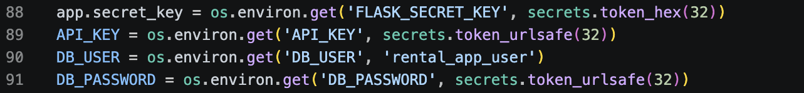
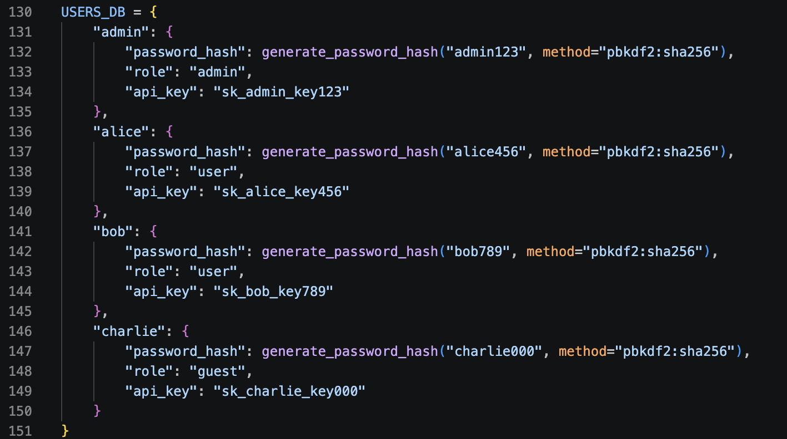
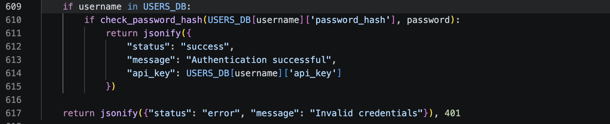
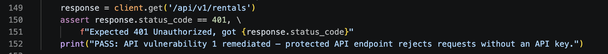
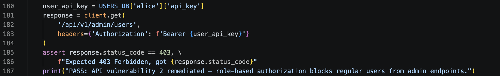
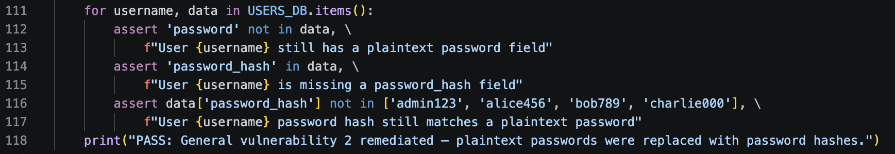

# Python Application Security Hardening

## Authentication, Secrets Management, and Access Control

## Overview

This project focused on improving the security posture of an existing Python Flask application by remediating several common application security vulnerabilities. The application originally contained hardcoded secrets, plaintext password storage, missing API authentication, and insufficient authorization controls that could allow unauthorized access to sensitive functionality.

The remediation introduced secure secret management using environment variables, PBKDF2-SHA256 password hashing, API authentication with Bearer tokens, and role-based access control (RBAC). Automated security tests were then executed to verify that each security control functioned as intended.

---

# Project Objectives

The primary goals of this project were to:

- Eliminate hardcoded secrets from the application.
- Replace plaintext password storage with secure password hashing.
- Implement API authentication for protected endpoints.
- Enforce role-based authorization using the principle of least privilege.
- Validate each security control through automated testing.

---

# Initial Assessment

A review of the application's source code identified several security weaknesses that could expose sensitive information or allow unauthorized access.

The primary findings included:

- Sensitive application secrets were hardcoded directly within the source code.
- User passwords were stored in plaintext.
- Protected API endpoints could be accessed without authentication.
- Administrative resources lacked proper authorization checks.
- Security controls required automated validation to verify successful remediation.

These findings established the remediation plan implemented throughout the project.

---

# Security Improvements

## Secure Secrets Management

Hardcoded application secrets were replaced with environment variables to prevent sensitive credentials from being stored directly in the application's source code. Secure random values are generated when environment variables are unavailable, improving the security of development environments while supporting safer configuration management.

---

## Secure Password Hashing

Plaintext password storage was replaced with PBKDF2-SHA256 password hashing using Werkzeug's `generate_password_hash()` function. Each user's password is securely hashed before storage, ensuring that plaintext credentials are never retained by the application. This approach significantly reduces the impact of a database compromise by protecting stored credentials with a one-way cryptographic hash.

---

## Secure Password Verification

User authentication was updated to verify submitted credentials using `check_password_hash()` instead of comparing plaintext passwords. This allows the application to authenticate users without storing or exposing the original password while rejecting invalid credentials with an appropriate **401 Unauthorized** response.

---

## API Authentication

Protected API endpoints now require a valid Bearer token before granting access. Requests without a valid API key are rejected, preventing unauthenticated users from accessing protected application resources.

---

## Role-Based Access Control

Role-based access control (RBAC) was implemented to enforce the principle of least privilege. Even with a valid API key, users are restricted to resources appropriate for their assigned role. Administrative endpoints now return **403 Forbidden** when accessed by non-administrative users.

---

# Testing & Verification

After implementing the security improvements, the application was validated using automated tests written with the **pytest** framework. Each test verifies a specific security remediation to confirm the implemented controls behave as expected.

## Password Hash Validation

Automated testing confirmed that plaintext password fields were successfully removed from the application. Each user record now contains a password hash rather than the original password, ensuring sensitive credentials are no longer stored in plaintext.

---

## Automated Security Validation

The completed implementation was validated through automated security testing. The test suite verified secure secret management, password hashing, API authentication, and role-based authorization. All tests completed successfully, confirming that each remediation functioned as intended.

---

# Lessons Learned

This project demonstrated how multiple application security vulnerabilities can be mitigated through secure coding practices and layered security controls. Replacing hardcoded secrets, protecting credentials with PBKDF2-SHA256 password hashing, enforcing API authentication, and implementing role-based authorization significantly strengthened the application's overall security posture.

The project also reinforced the importance of validating security improvements through automated testing. Security controls should not only be implemented but also verified to ensure they continue functioning correctly as an application evolves.

---

# Skills Demonstrated

- Python
- Flask
- Application Security
- Secure Coding
- Secrets Management
- Environment Variables
- PBKDF2-SHA256
- Password Hashing
- Password Verification
- API Authentication
- Bearer Token Authentication
- Role-Based Access Control (RBAC)
- Authentication & Authorization
- Automated Security Testing
- Pytest
- Software Security Testing
