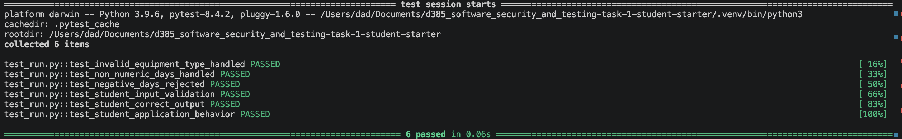
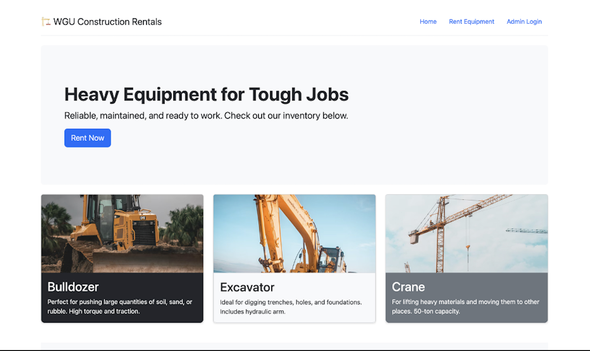
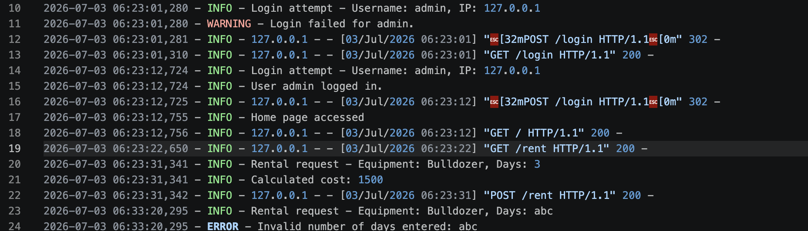
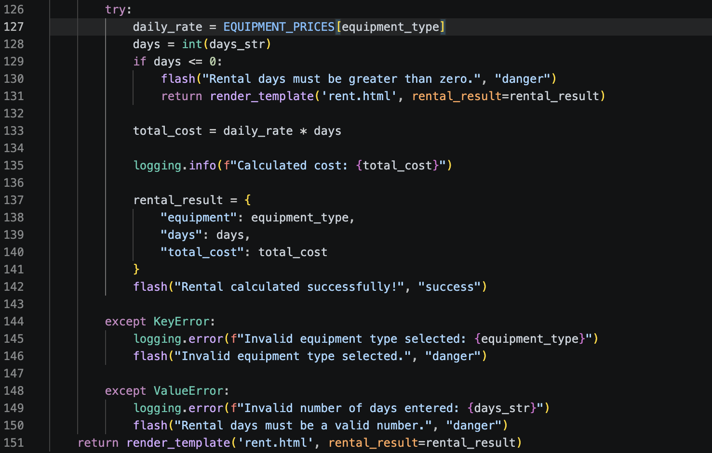

# Secure Flask Application with Defensive Programming

## Overview

This project focused on improving the security, reliability, and resilience of an existing Python Flask application by implementing defensive programming techniques. After reviewing the application's source code, I identified opportunities to strengthen input validation, exception handling, and application logging to better protect the application from invalid input and unexpected runtime conditions.

The application was enhanced by implementing assertions, structured logging, input validation, and exception handling while preserving existing functionality. Automated testing and manual verification were then performed to confirm the security improvements were successfully integrated without introducing regressions.

---

# Project Objectives

The primary objectives of this project were to:

- Analyze an existing Flask application for security and reliability weaknesses.
- Implement defensive programming techniques to improve application stability.
- Validate user input before processing requests.
- Implement structured application logging to improve troubleshooting and security monitoring.
- Verify the effectiveness of the security improvements through automated and manual testing.

---

# Initial Assessment

Before implementing any code changes, I reviewed the application's source code to identify areas that could negatively impact security, reliability, and maintainability.

The review identified several opportunities for improvement:

- Limited input validation allowed invalid data to be processed.
- Runtime exceptions could cause unexpected application failures.
- Application events relied primarily on console output instead of structured logging.
- Critical values were not validated before use.
- Error handling could be improved to provide more graceful responses to invalid user input.

These findings established the roadmap for the defensive programming improvements implemented throughout the project.

---

# Security Improvements

Several defensive programming techniques were implemented to improve the application's resilience and operational reliability.

## Input Validation

User input is validated before processing to ensure only expected values are accepted. This prevents invalid rental durations and other unexpected input from being processed.

## Exception Handling

`try/except` blocks were added to gracefully handle expected runtime exceptions, including invalid equipment selections and non-numeric rental duration values. Rather than terminating unexpectedly, the application logs the error and returns an appropriate response to the user.

## Assertions

Assertions were implemented to validate critical application assumptions before processing user requests. These checks help identify invalid application states early in the execution process.

## Structured Logging

Python's built-in `logging` module replaced console output with structured application logging. Informational events, warnings, and errors are recorded to support troubleshooting, operational visibility, and security monitoring.

## Improved Application Stability

By combining assertions, input validation, exception handling, and structured logging, the application became significantly more resilient against invalid input while maintaining expected functionality for legitimate users.

---

# Testing & Verification

After implementing the security improvements, the application was validated through both automated and manual testing to verify that the defensive programming controls functioned correctly.

## Automated Testing

The updated application was tested using **pytest** to verify that the defensive programming enhancements did not introduce regressions. All six automated tests completed successfully, confirming that application functionality was preserved while validating the newly implemented security controls.

---

## Application Verification

The updated Flask application was launched locally to verify that the user interface, routing, and equipment rental workflow continued to function correctly after the security improvements were implemented.

---

## Structured Logging

Structured logging was verified by reviewing application log entries generated during execution. Informational events, warnings, and errors were successfully captured, providing an audit trail that supports troubleshooting and security monitoring.

---

## Defensive Programming Implementation

The following code demonstrates several of the defensive programming techniques implemented during the project, including input validation, exception handling, and structured application logging.

---

# Lessons Learned

This project reinforced the importance of defensive programming when developing secure and reliable software. Implementing assertions, input validation, structured logging, and exception handling demonstrated how relatively small code changes can significantly improve an application's resilience against invalid input and unexpected runtime conditions. The project also reinforced the value of automated testing in verifying that security improvements preserve existing functionality while reducing the risk of introducing new defects.

---

# Skills Demonstrated

- Python
- Flask
- Defensive Programming
- Secure Coding Practices
- Input Validation
- Assertions
- Exception Handling
- Structured Logging
- Application Logging
- Automated Testing with Pytest
- Software Security Testing
- Application Debugging
