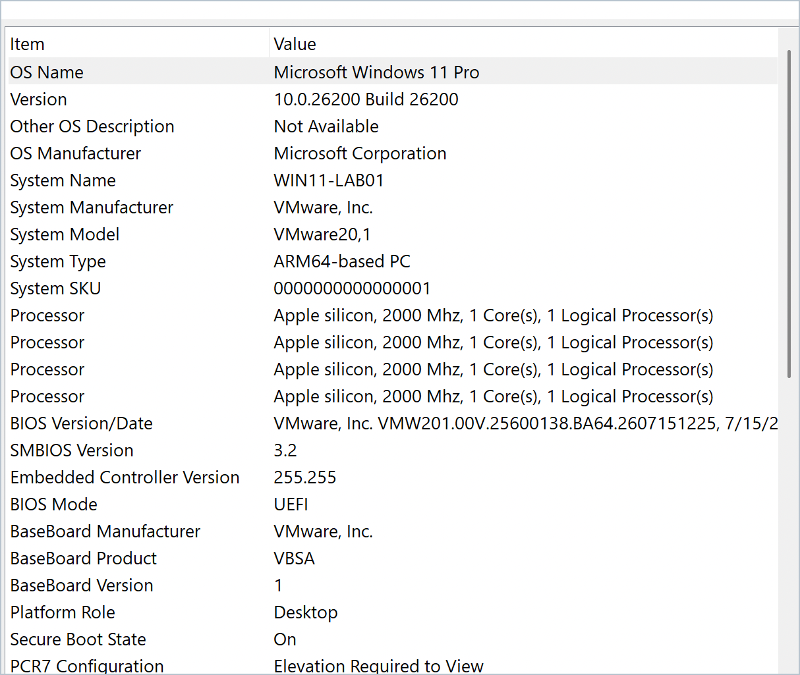
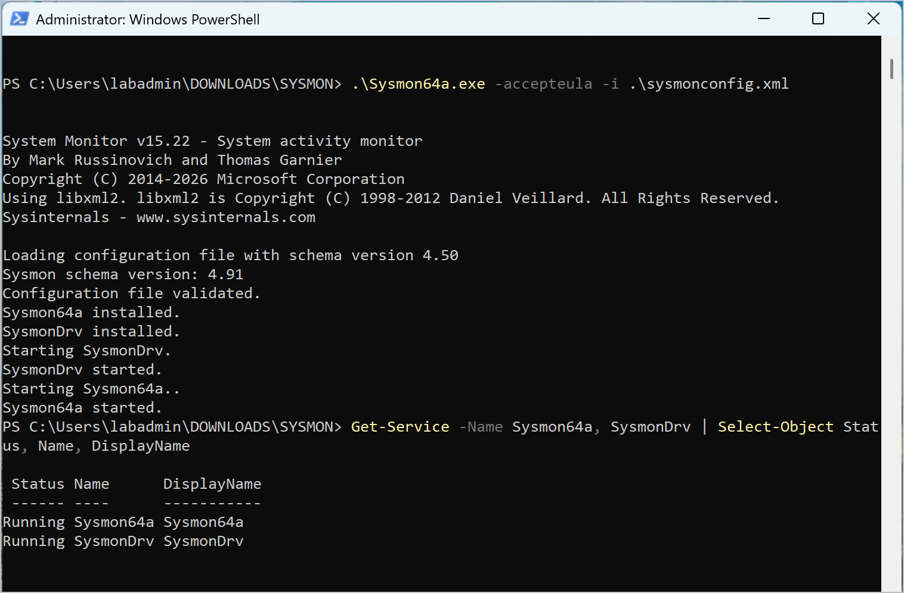
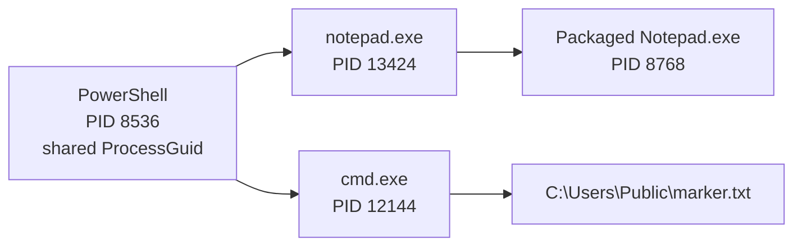
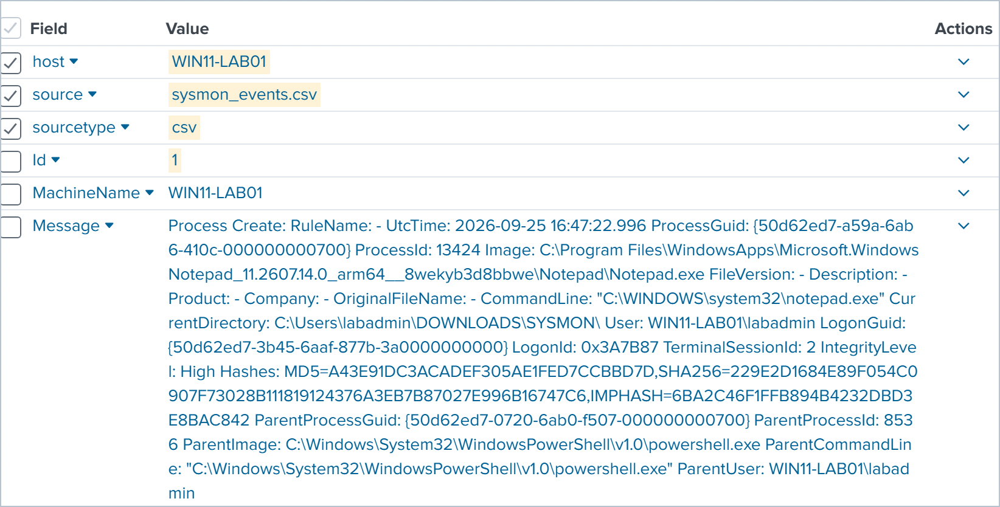
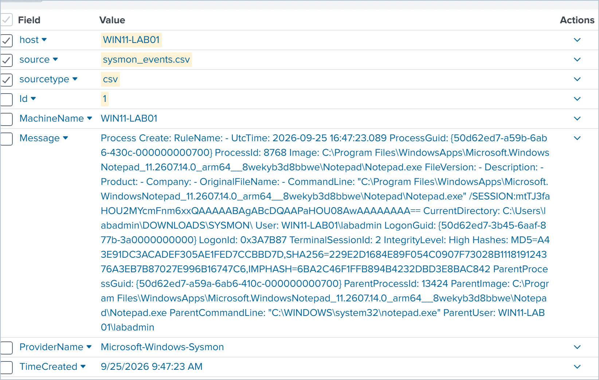
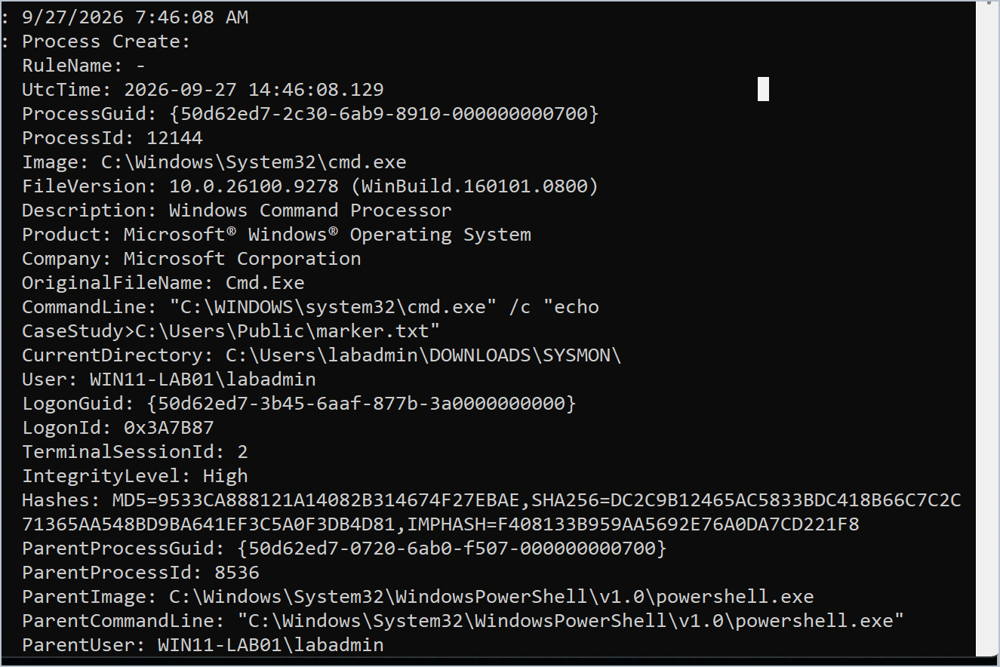

# 🔎 Controlled Windows Endpoint Telemetry Reconstruction with Sysmon and Splunk

## 📌 Overview

Built a controlled Windows 11 endpoint laboratory, enabled Sysmon telemetry, ingested exported events into Splunk Cloud, and reconstructed two deliberately generated process chains from process-creation evidence.

The activity was generated deliberately for telemetry validation. This is a **controlled reconstruction lab**, not a case that began from an unknown production alert. The final disposition was **benign controlled laboratory activity**.

👉 [View the complete investigation report (PDF)](../reports/suspicious-windows-endpoint-investigation.pdf)

---

## 🎯 Objectives

- Build a reproducible Windows endpoint investigation environment
- Install and validate Sysmon telemetry
- Ingest endpoint events into Splunk Cloud
- Isolate Sysmon Event ID 1 process creation records
- Reconstruct parent-child process relationships
- Test PID reuse as an alternative explanation by comparing `ProcessGuid` values
- Distinguish relevant evidence from routine PowerShell activity
- Document findings with defensible scope and limitations

---

## 🖥️ Environment

- **Endpoint:** Windows 11 Pro on an ARM64 VMware virtual machine
- **Host:** `WIN11-LAB01`
- **Endpoint telemetry:** Microsoft Sysmon v15.22 ARM64
- **Analysis platform:** Splunk Cloud Search and Reporting
- **Data collection:** Manual CSV exports from the Sysmon Operational event log
- **Network:** NAT through the host connection



---

## ⚙️ Telemetry Validation

Sysmon was installed with a validated configuration. The Sysmon service and driver both reported a running state, and recent events were present in the `Microsoft-Windows-Sysmon/Operational` log.



The initial Splunk dataset contained **89 events**, including **53 Sysmon Event ID 1 process creation records**. A later export expanded the working dataset to **1,029 events** and captured the controlled command-shell test.

---

## 🔬 Investigation Method

1. Validated the uploaded source, host, sourcetype, and event volume.
2. Filtered for Sysmon Event ID 1 process creation events.
3. Searched for controlled Notepad execution.
4. Compared `ProcessGuid` and `ParentProcessGuid` values across both dates to reconstruct lineage without relying on reusable PIDs.
5. Generated a marker-file test through `cmd.exe` from PowerShell.
6. Located the command in Splunk and verified its parent process.
7. Decoded the shared parent GUID's time component and compared it with the Sysmon installation date.
8. Reviewed nearby PowerShell file events and excluded unrelated policy-test files.

Historical discovery search used against the generic CSV dataset:

```spl
source="case_events.csv" host="WIN11-LAB01" sourcetype="csv" "ProcessId: 8536"
```

Because the generic CSV export included serialized .NET event-object metadata, the embedded Sysmon `Message` content was treated as the authoritative event narrative. This raw-text search found the recorded case; it is not presented as a reusable production detection.

---

## 🔗 Reconstructed Process Activity



### Notepad chain

- PowerShell process instance `{50d62ed7-0720-6ab0-f507-000000000700}` (PID `8536`) launched `notepad.exe` PID `13424`.
- Notepad PID `13424` launched the packaged Notepad process PID `8768`.
- The packaged process's `ParentProcessGuid` exactly matched the first Notepad event's `ProcessGuid`, supporting the complete two-stage lineage.





### Marker-file chain

- The same PowerShell process instance launched `cmd.exe` PID `12144`.
- The recorded command wrote `CaseStudy` to `C:\Users\Public\marker.txt`.
- The event ran as `WIN11-LAB01\labadmin` with high integrity.
- Local verification returned the expected marker-file content.



### Parent identity check

The September 25 Notepad event and September 27 `cmd.exe` event record the exact same `ParentProcessGuid`:

`{50d62ed7-0720-6ab0-f507-000000000700}`

That match establishes one shared PowerShell process instance; PID `8536` alone would not be enough because Windows can reuse PIDs. As a reproducibility check, the GUID time fields form hexadecimal `6ab00720`, which converts to approximately `2026-09-20 16:17:36 UTC`. The child GUIDs decode to their recorded event seconds using the same method. The shared parent therefore began before Sysmon was installed on September 25, explaining why its process-creation event is absent. The evidence does not establish why that PowerShell process remained active.

---

## 🧭 Event Timeline

| UTC time | Event | Finding |
|---|---|---|
| 2026-09-25 16:47:22.996 | Process creation | PowerShell PID 8536 launched Notepad PID 13424 |
| 2026-09-25 16:47:23.089 | Process creation | Notepad PID 13424 launched packaged Notepad PID 8768 |
| 2026-09-27 14:46:08.129 | Process creation | PowerShell PID 8536 launched cmd.exe PID 12144 |
| 2026-09-27 14:46:08.129 | Command line | `cmd.exe` wrote `CaseStudy` to the marker file |

---

## 🧠 Analyst Assessment

The selected events matched the documented lab actions. Executable names such as PowerShell and `cmd.exe` can appear in malicious activity, but names alone do not establish intent. The command lines, account, timestamps, process GUIDs, parent-child relationships, and resulting artifact were evaluated together. The exact GUID match rules out ordinary PID reuse as the explanation for the shared parent.

Two nearby `__PSScriptPolicyTest_*.ps1` file events were routine PowerShell policy checks. They did not reference the marker path and were excluded from the primary finding.

**Disposition:** Benign controlled laboratory activity.

**Confidence:** High for the reconstructed process chains; moderate for the broader no-compromise conclusion because the dataset consisted of manual snapshots rather than continuous telemetry.

---

## 🧩 MITRE ATT&CK Context

- **T1059.001 — PowerShell:** PowerShell served as the parent shell for controlled process launches.
- **T1059.003 — Windows Command Shell:** `cmd.exe` executed the marker-file command.

These mappings describe observable techniques and are included for detection-engineering context. They do not make the controlled activity malicious.

---

## ⚠️ Limitations

- The investigation used manual CSV snapshots rather than continuous endpoint forwarding.
- The shared PowerShell process began before Sysmon installation, so its Event ID 1 creation record could not have been collected.
- The evidence confirms the parent identity but not why the PowerShell process remained active across the two dates.
- No memory image, disk image, packet capture, or enterprise identity telemetry was collected.
- Conclusions apply only to the selected events and available evidence.

---

## 🚧 Follow-on Detection Project

The next case will start from an alert and use controlled Atomic Red Team activity rather than a known-answer reconstruction. Planned improvements include continuous Sysmon forwarding with the Splunk Universal Forwarder, parsed fields such as `EventCode`, `ParentImage`, and `CommandLine`, reusable field-based SPL searches, a Sigma rule, and a SOC-style disposition with recommended action. Those capabilities are planned for the next project and are not claimed as results of this one.

---

## 🛠️ Skills Demonstrated

- Windows endpoint telemetry configuration
- Sysmon event interpretation
- Splunk ingestion and SPL searching
- Parent-child process analysis
- Timeline reconstruction
- Evidence handling and reporting
- MITRE ATT&CK mapping
- False-positive and alternative-explanation analysis
- Defensible scoping of investigative conclusions

---

## 📊 Conclusion

This project demonstrates a foundational endpoint telemetry workflow: building the lab, validating telemetry, ingesting events, narrowing a dataset, reconstructing process lineage, testing an alternative explanation, excluding unrelated activity, and communicating a supported conclusion.

The strongest finding was the confirmed chain:

`PowerShell ProcessGuid {50d62ed7-0720-6ab0-f507-000000000700} → cmd.exe PID 12144 → C:\Users\Public\marker.txt`

The complete evidence index, methodology, limitations, and recommendations are available in the [final report](../reports/suspicious-windows-endpoint-investigation.pdf).
