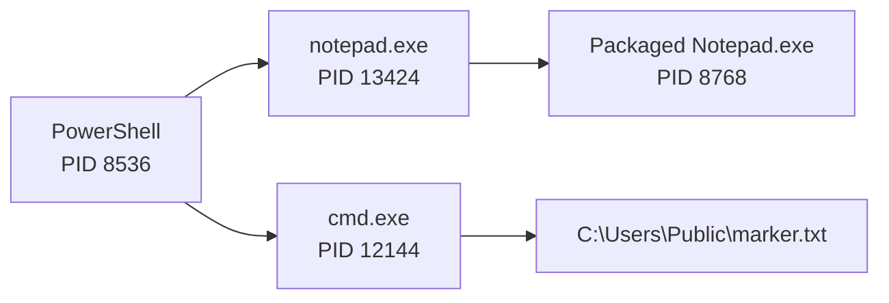

# 🔎 Suspicious Windows Endpoint Investigation with Sysmon and Splunk

## 📌 Overview

Built a controlled Windows 11 endpoint laboratory, enabled Sysmon telemetry, ingested exported events into Splunk Cloud, and reconstructed two process chains from process creation evidence.

The activity was generated deliberately for telemetry validation. The final disposition was **benign controlled laboratory activity**, not an unauthorized compromise.

👉 [View the complete investigation report (PDF)](../reports/suspicious-windows-endpoint-investigation.pdf)

---

## 🎯 Objectives

- Build a reproducible Windows endpoint investigation environment
- Install and validate Sysmon telemetry
- Ingest endpoint events into Splunk Cloud
- Isolate Sysmon Event ID 1 process creation records
- Reconstruct parent-child process relationships
- Distinguish relevant evidence from routine PowerShell activity
- Document findings with defensible scope and limitations

---

## 🖥️ Environment

- **Endpoint:** Windows 11 Pro on an ARM64 VMware virtual machine
- **Host:** `WIN11-LAB01`
- **Endpoint telemetry:** Microsoft Sysmon v15.22 ARM64
- **Analysis platform:** Splunk Cloud Search and Reporting
- **Data collection:** Manual CSV exports from the Sysmon Operational event log
- **Network:** NAT through the host connection


---

## ⚙️ Telemetry Validation

Sysmon was installed with a validated configuration. The Sysmon service and driver both reported a running state, and recent events were present in the `Microsoft-Windows-Sysmon/Operational` log.


The initial Splunk dataset contained **89 events**, including **53 Sysmon Event ID 1 process creation records**. A later export expanded the working dataset to **1,029 events** and captured the controlled command-shell test.

---

## 🔬 Investigation Method

1. Validated the uploaded source, host, sourcetype, and event volume.
2. Filtered for Sysmon Event ID 1 process creation events.
3. Searched for controlled Notepad execution.
4. Compared process and parent-process identifiers to reconstruct lineage.
5. Generated a marker-file test through `cmd.exe` from PowerShell.
6. Located the command in Splunk and verified its parent process.
7. Reviewed nearby PowerShell file events and excluded unrelated policy-test files.

Example investigation search:

```spl
source="case_events.csv" host="WIN11-LAB01" sourcetype="csv" "ProcessId: 8536"
```

Because the generic CSV export included serialized .NET event-object metadata, the embedded Sysmon `Message` content was treated as the authoritative event narrative.

---

## 🔗 Reconstructed Process Activity



### Notepad chain

- PowerShell PID `8536` launched `notepad.exe` PID `13424`.
- Notepad PID `13424` launched the packaged Notepad process PID `8768`.
- Parent and child identifiers supported the complete two-stage lineage.

### Marker-file chain

- PowerShell PID `8536` launched `cmd.exe` PID `12144`.
- The recorded command wrote `CaseStudy` to `C:\Users\Public\marker.txt`.
- The event ran as `WIN11-LAB01\labadmin` with high integrity.
- Local verification returned the expected marker-file content.

---

## 🧭 Event Timeline

| UTC time | Event | Finding |
|---|---|---|
| 2026-09-25 16:47:22.996 | Process creation | PowerShell PID 8536 launched Notepad PID 13424 |
| 2026-09-25 16:47:23.089 | Process creation | Notepad PID 13424 launched packaged Notepad PID 8768 |
| 2026-09-27 14:46:08.129 | Process creation | PowerShell PID 8536 launched cmd.exe PID 12144 |
| 2026-09-27 14:46:08.129 | Command line | `cmd.exe` wrote `CaseStudy` to the marker file |

---

## 🧠 Analyst Assessment

The selected events matched the documented lab actions. Executable names such as PowerShell and `cmd.exe` can appear in malicious activity, but names alone do not establish intent. The command lines, account, timestamps, parent-child relationships, and resulting artifact were evaluated together.

Two nearby `__PSScriptPolicyTest_*.ps1` file events were routine PowerShell policy checks. They did not reference the marker path and were excluded from the primary finding.

**Disposition:** Benign controlled laboratory activity.

**Confidence:** High for the reconstructed process chains; moderate for the broader no-compromise conclusion because the dataset consisted of manual snapshots rather than continuous telemetry.

---

## 🧩 MITRE ATT&CK Context

- **T1059.001 — PowerShell:** PowerShell served as the parent shell for controlled process launches.
- **T1059.003 — Windows Command Shell:** `cmd.exe` executed the marker-file command.

These mappings describe observable techniques and are included for detection-engineering context. They do not make the controlled activity malicious.

---

## ⚠️ Limitations

- The investigation used manual CSV snapshots rather than continuous endpoint forwarding.
- The process creation record for the long-running PowerShell PID was not present in the imported snapshot.
- No memory image, disk image, packet capture, or enterprise identity telemetry was collected.
- Conclusions apply only to the selected events and available evidence.

---

## 🛠️ Skills Demonstrated

- Windows endpoint telemetry configuration
- Sysmon event interpretation
- Splunk ingestion and SPL searching
- Parent-child process analysis
- Timeline reconstruction
- Evidence handling and reporting
- MITRE ATT&CK mapping
- False-positive and alternative-explanation analysis
- Defensible scoping of investigative conclusions

---

## 📊 Conclusion

This project demonstrates an end-to-end endpoint investigation workflow: building the lab, validating telemetry, ingesting events, narrowing a dataset, reconstructing process lineage, excluding unrelated activity, and communicating a supported conclusion.

The strongest finding was the confirmed chain:

`PowerShell PID 8536 → cmd.exe PID 12144 → C:\Users\Public\marker.txt`

The complete evidence index, methodology, limitations, and recommendations are available in the [final report](../reports/suspicious-windows-endpoint-investigation.pdf).
